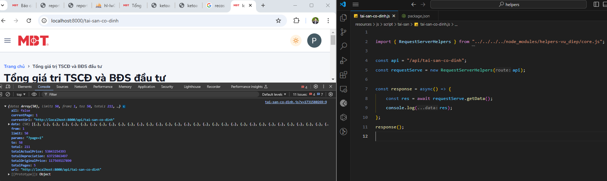
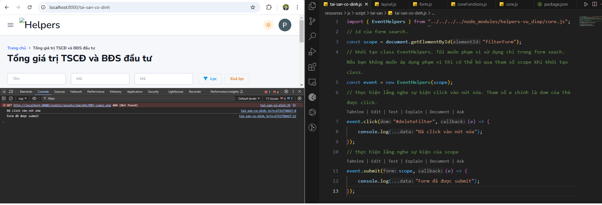

I. Bắt đầu với Helpers.

- Giới thiệu: Helpers là một thư viện javascript được sinh ra nhằm giúp nhân viên làm việc tại ASFY Tech code frontend
nhanh hơn.

- Logic hoạt động: Helpers được chia thành 2 phần chính là layout và form, layout có tác dụng hiển thị dữ liệu sau khi
gọi api, form có tác dụng thực hiện công việc gửi dữ liệu lên backend.

- Tải thư viện: Khi bạn tiếp cận với một base code mới do quản lý cấp việc đầu tiên của bạn là chạy câu lệnh sau npm
install helpers-vu_diep@latest mục đích nhằm cập nhật phiên bản mới nhất về. Với các phiên bản ^1.1.7 thì chỉ sử dụng
với base laravel.

Hướng đẫn cài đặt:

- Đối với 1 file view có blade thì bạn cần tạo 1 file js ở trong thư mục resources/js/script.... để viết js riêng.
- VD: Trong hình tôi có tạo 1 thư mục bên trong script/tai-san/tai-san-co-dinh.js. Tiếp theo ở file view tôi tạo
section('script') và link sang file tai-san-co-dinh.js với type="module"

- Lưu ý: Các bạn nên tạo như trong hình để tránh bị lỗi nhé !

II. Tổng quan về các file trong thư viện

1. common.js file chứa các function dùng chung cho các dự án trước đó.
2. coreFunctions.js file chứa các function sử dụng cho thư viện
3. core.js file chứa các class dùng chung cho toàn bộ thư viện
4. form.js file chứa các thao tác với form
5. layout.js file chứa các class thao tác với layout

III. Hướng đẫn sử dụng các class trong core.js

1. RequestServerHelpers class thao tác với server

- Khi bạn khởi tạo class bạn phải truyền vào 1 api để có thể sử dụng các phương tức trong đó.
VD: Bây giờ hãy quay lại file tai-san-co-dinh.js bạn mới tạo ở trên rồi khởi tạo nó nhé. Lưu ý hãy import
RequestServerHelpers với đường đẫn tuyệt đối vào trước khi khởi tạo nhé.

- Giới thiệu các thuộc tính:

* route: Là api bạn truyền vào được sử dụng để giao tiếp với backend
* params: Params truyền vào khi bạn gửi yêu cầu
* statusMessage: Xác định xem có cần thông báo xong sau khi gửi request server không. Nếu bạn để false thì cả thông báo
lỗi và thông báo thành công sẽ không được hiển thị.
* headers: Sử dụng khi bạn gọi các phương thức gửi dữ liệu, thông thường tôi sẽ sử dụng nó để gửi formData

- Giới thiệu các phương thức
1.1 Phương thức getData: Phương thức có tác dụng lấy ra dữ liệu và trả về dữ liệu sau khi gửi request. Lưu ý: Hàm
getData sẽ trả về Promise vậy nên bạn phải sử dụng async, await thì mới lấy được dữ liệu nhé.
- Giới thiệu các thuộc tính:

* api: Tham số này giúp bạn linh hoạt gọi các api khác mà không phải khởi tạo lại class. Nếu bạn không truyền thì nó mặc
định sẽ lấy ra api bạn truyền vào khi khởi tạo class.

1.2 Phương thức postData: Phương thức có tác dụng gửi dữ liệu với method post và trả về object sau khi gửi request.

- Giới thiệu các thuộc tính:

* data: Dữ liệu gửi đi
* debug: Thực hiện debug khi bạn test
* api: Tham số này giúp bạn linh hoạt gọi các api khác mà không phải khởi tạo lại class. Nếu bạn không truyền thì nó mặc
định sẽ lấy ra api bạn truyền vào khi khởi tạo class.

1.3 Phương thức putData: Phương thức có tác dụng gửi dữ liệu với method put và trả về object sau khi gửi request.

- Giới thiệu các thuộc tính:

* data: Dữ liệu gửi đi
* debug: Thực hiện debug khi bạn test
* api: Tham số này giúp bạn linh hoạt gọi các api khác mà không phải khởi tạo lại class. Nếu bạn không truyền thì nó mặc
định sẽ lấy ra api bạn truyền vào khi khởi tạo class.
* Bạn đang thắc mắc là đối với phương thức put thì id sẽ để ở đâu đúng không ? Đừng vội tôi sẽ chỉ cho bạn thấy cách tôi
đưa id vào với method put ngay đây.

2. Class EventHelpers: Class này có tác dụng lắng nghe sự kiện của 1 thẻ.

- Giới thiệu các thuộc tính:

* scope: Phạm vi mà các dom được phép lắng nghe. Giả sử bạn chỉ muốn lắng nghe sự kiện của 1 form. Thì bạn truyền dom
của form đó khi khởi tạo class như vậy các sự kiện sẽ chỉ được lắng nghe trong form đó. Nếu bạn không truyền scope thì
nó sẽ mặc định là document.

2.1 Phương thức addEvent: Lắng nghe các sự sự kiện của 1 thẻ và thực hiện gọi hàm callback.

- Giới thiệu các thuộc tính:

* dom: id hoặc class của thẻ cần lắng nghe
* eventType: Loại event
* callback: Function thực hiện công việc nào đó

2.2 Các event hiện có: input, click, change, addItem, search, submit: Các phương thức này đều có điểm chung là nhận vào 1 dom và lắng nghe các sự kiện sau đó gọi 1 hàm callback để thực hiện công việc người dùng muốn.

Lưu ý:  Trong trường hợp thẻ bạn cần lắng nghe chính là scope thì cứ mạnh dạng truyền vào dom của
scope nó vẫn sẽ hiểu và lắng nghe.

3. Class URLHelpers: Class này làm việc với url

- Giới thiệu các thuộc tính:

* url: Là url bạn muốn sử dụng, mặc định là url hiện tại

III. Hướng đẫn sử dụng layout
Để có thể sử dụng layout chúng ta cùng đi tìm hiểu sâu hơn bạn hãy mở file layout.js tôi sẽ giới thiệu cho bạn từng
class và cách thức hoạt động ở bên trong nhé.

1. PaginationHelpers class thực hiện công việc phân trang khi sử dụng bạn cần truyền vào các tham số sau:

- data object trả về từ backend có chứa phân trang
- renderUI function gọi ra giao diện
- pagination Id thẻ html nơi đổ dữ liệu phân trang

VD:
