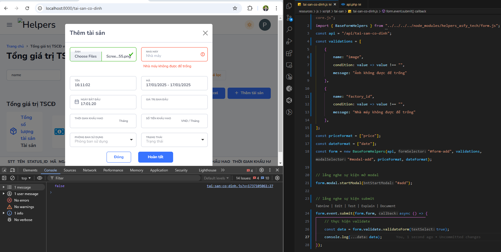

<h2>Lời mở đầu.</h2>

Xin chào bạn tôi là một lần trình viên trẻ khi tôi viết thư viện này tôi đang làm ở ASFY Tech, thư viện này sinh ra
    nhằm giúp mọi người ở công ty viết code javascript đơn giản hơn. Tôi chỉ có một mong muốn là mọi người có thể sử
    dụng thư viện này và phát triển nó lên cho hợp với thời đại mới của công ty.

<h2>I. Bắt đầu với Helpers.</h2>

    - Logic hoạt động: Helpers được chia thành 2 phần chính là layout và form, layout có tác dụng hiển thị dữ liệu sau
    khi
    gọi api, form có tác dụng thực hiện công việc gửi dữ liệu lên backend.

- Tải thư viện: Khi bạn tiếp cận với một base code mới do quản lý cấp việc đầu tiên của bạn là chạy câu lệnh sau:

<code> npm install helpers_asfy_tech@latest</code>

Mục đích nhằm cập nhật phiên bản mới nhất về. Với các phiên bản ^1.1.7 thì chỉ sử dụng
với base laravel.

- Sử dụng câu lệnh sau để tạo file view: <code> php artisan make:view tai-san/tai-san-co-dinh --d </code>

<h4>Hướng đẫn cài đặt:</h4>

- Đối với 1 file view có blade thì bạn cần tạo 1 file js ở trong thư mục resources/js/script.... để viết js riêng.
- VD: Trong hình tôi có tạo 1 thư mục bên trong script/tai-san/tai-san-co-dinh.js. Tiếp theo ở file view tôi tạo
section('script') và link sang file tai-san-co-dinh.js với type="module"

- Lưu ý: Các bạn nên tạo như trong hình để tránh bị lỗi nhé !

<h2>II. Tổng quan về các file trong thư viện</h2>

1. common.js file chứa các function dùng chung cho các dự án trước đó.
2. coreFunctions.js file chứa các function sử dụng cho thư viện
3. core.js file chứa các class dùng chung cho toàn bộ thư viện
4. form.js file chứa các thao tác với form
5. layout.js file chứa các class thao tác với layout

<h2>III. Hướng đẫn sử dụng các class trong core.js</h2>

<h4>1. RequestServerHelpers class thao tác với server</h4>

- Khi bạn khởi tạo class bạn phải truyền vào 1 api để có thể sử dụng các phương tức trong đó.
VD: Bây giờ hãy quay lại file tai-san-co-dinh.js bạn mới tạo ở trên rồi khởi tạo nó nhé. Lưu ý hãy import
RequestServerHelpers với đường đẫn tuyệt đối vào trước khi khởi tạo nhé.

<h5>- Giới thiệu các thuộc tính:</h5>

<ul>
    <li>route: Là api bạn truyền vào được sử dụng để giao tiếp với backend</li>
    <li>params: Params truyền vào khi bạn gửi yêu cầu</li>
    <li>statusMessage: Xác định xem có cần thông báo xong sau khi gửi request server không. Nếu bạn để false thì cả
        thông báo
        lỗi và thông báo thành công sẽ không được hiển thị.</li>
    <li> headers: Sử dụng khi bạn gọi các phương thức gửi dữ liệu, thông thường tôi sẽ sử dụng nó để gửi formData</li>
</ul>

<h5>- Giới thiệu các phương thức</h5>
<b>1.1 Phương thức getData:</b> Phương thức có tác dụng lấy ra dữ liệu và trả về dữ liệu sau khi gửi request. Lưu ý: Hàm
getData sẽ trả về Promise vậy nên bạn phải sử dụng async, await thì mới lấy được dữ liệu nhé.
<h5>- Giới thiệu các thuộc tính:</h5>

* api: Tham số này giúp bạn linh hoạt gọi các api khác mà không phải khởi tạo lại class. Nếu bạn không truyền thì nó mặc
định sẽ lấy ra api bạn truyền vào khi khởi tạo class.

<b>1.2 Phương thức postData:</b> Phương thức có tác dụng gửi dữ liệu với method post và trả về object sau khi gửi
request.

<h5>- Giới thiệu các thuộc tính:</h5>

* data: Dữ liệu gửi đi
* debug: Thực hiện debug khi bạn test
* api: Tham số này giúp bạn linh hoạt gọi các api khác mà không phải khởi tạo lại class. Nếu bạn không truyền thì nó mặc
định sẽ lấy ra api bạn truyền vào khi khởi tạo class.

<b>1.3 Phương thức putData:</b> Phương thức có tác dụng gửi dữ liệu với method put và trả về object sau khi gửi request.

<h5>- Giới thiệu các thuộc tính:</h5>

* data: Dữ liệu gửi đi
* debug: Thực hiện debug khi bạn test
* api: Tham số này giúp bạn linh hoạt gọi các api khác mà không phải khởi tạo lại class. Nếu bạn không truyền thì nó mặc
định sẽ lấy ra api bạn truyền vào khi khởi tạo class.
* Bạn đang thắc mắc là đối với phương thức put thì id sẽ để ở đâu đúng không ? Đừng vội tôi sẽ chỉ cho bạn thấy cách tôi
đưa id vào với method put ngay đây.

<b>1.3 Phương thức requestData:</b> Phương thức có tác dụng gửi dữ liệu với method do chúng ta quyết định và trả về
object sau khi gửi request. Phương thức này thường được dùng cho việc xóa, hoặc cập nhận trạng thái

<h5>- Giới thiệu các thuộc tính:</h5>

* method: Loại method truyền vào
* api: Tham số này giúp bạn linh hoạt gọi các api khác mà không phải khởi tạo lại class. Nếu bạn không truyền thì nó mặc
định sẽ lấy ra api bạn truyền vào khi khởi tạo class.

<h4>2. Class EventHelpers: Class này có tác dụng lắng nghe sự kiện của 1 thẻ.</h4>

<h5>- Giới thiệu các thuộc tính:</h5>

* scope: Phạm vi mà các dom được phép lắng nghe. Giả sử bạn chỉ muốn lắng nghe sự kiện của 1 form. Thì bạn truyền dom
của form đó khi khởi tạo class như vậy các sự kiện sẽ chỉ được lắng nghe trong form đó. Nếu bạn không truyền scope thì
nó sẽ mặc định là document.

<b>2.1 Phương thức addEvent:</b> Lắng nghe các sự sự kiện của 1 thẻ và thực hiện gọi hàm callback.

<h5>- Giới thiệu các thuộc tính:</h5>

* dom: id hoặc class của thẻ cần lắng nghe
* eventType: Loại event
* callback: Function thực hiện công việc nào đó

<b>2.2 Các event hiện có:</b> input, click, change, addItem, search, submit: Các phương thức này đều có điểm chung là
nhận vào
1 dom và lắng nghe các sự kiện sau đó gọi 1 hàm callback để thực hiện công việc người dùng muốn.

Lưu ý: Trong trường hợp thẻ bạn cần lắng nghe chính là scope thì cứ mạnh dạng truyền vào dom của
scope nó vẫn sẽ hiểu và lắng nghe.

<h4>3. Class URLHelpers: Class này làm việc với url</h4>

<h5>- Giới thiệu các thuộc tính:</h5>

* url: Là url bạn muốn sử dụng, mặc định là url hiện tại

<b>3.1 getLastPathSegment: </b> Hàm này có tác dụng lấy ra phần cuối cùng trên url thường dùng cho việc lấy ra id.
    

<b>3.2 getParams: </b> Hàm có tác dụng lấy params trên url
<h5>- Giới thiệu các thuộc tính:</h5>
<ul>
    <li>key: Nhận vào key của param nếu bạn chỉ cần lấy 1 trường cụ thế. Nếu bạn muốn lấy tất cả param có trên url thì
        không cần quan tâm đến trường này</li>
</ul>

<b>3.3 removeParam: </b> Hàm có tác dụng xóa params trên url
<h5>- Giới thiệu các thuộc tính:</h5>
<ul>
    <li>key: Nhận vào key của param nếu bạn chỉ cần xóa 1 trường cụ thế. Nếu bạn muốn xóa tất cả param có trên url thì
        không cần quan tâm đến trường này</li>
</ul>

<b>3.4 removeParamsExcept: </b> Hàm có tác dụng xóa params trên url nhưng sẽ không xóa params bạn muốn
<h5>- Giới thiệu các thuộc tính:</h5>
<ul>
    <li>keysToKeep: Nhận vào array các key mà bạn không muốn xóa trên url</li>
</ul>

<b>3.5 addParamsToURL: </b> Hàm có tác dụng thêm params trên url 
<h5>- Giới thiệu các thuộc tính:</h5>
<ul>
    <li>params: Nhận vào array các key mà bạn muốn thêm trên url</li>
</ul>

<h4>4. Class ConfirmHelpers: Class này làm việc với confirm khi bạn muốn hỏi người dùng làm việc gì đó</h4>

<h5>- Giới thiệu các thuộc tính:</h5>
<ul>
    <li>
        config: Cấu hình khi hiển thị confirm
        <ul>
            <li>text: Đoạn text hiển thị</li>
            <li>btnText: Nội dung nút xác nhận</li>
            <li>btnBg: Màu nút</li>
            <li>title: Tiêu đề của nút</li>
            <li>sucess: Hàm được sử dụng sau khi người dùng đồng ý</li>
        </ul>
    </li>
</ul>

<b>4.1 loading: </b> Thực hiện loading ở nút button 
<h5>- Giới thiệu các thuộc tính:</h5>
<ul>
    <li>type: Trạng thái bật hay tắt loading. False: Tắt, True: Bật</li>
</ul>

<b>4.2 hide: </b> Thực hiện ẩn confirm 

<b>4.3 show: </b> Thực hiện show confirm 

<b>Ví dụ: </b>

<h4>4. Class FileHelpers: Class này làm việc thao tác với việc xử lý file</h4>
<b>4.1 exportExcel và exportPDF: </b> Hàm có tác dụng tải file PDF và Excel 
<h5>- Giới thiệu các thuộc tính:</h5>
<ul>
    <li>api: api xuất file</li>
    <li>name: Tên file</li>
    <li>dom: Id hoặc class thẻ lắng nghe sự kiện. Khi bạn không truyền tham số cho thuộc tính này thì nó tự động tải
        file</li>
    <li>params: params đi kèm</li>
    <li>getParams: Lấy params động rồi đi kèm</li>
</ul>

<h2>VI. Hướng đẫn sử dụng các class trong layout.js</h2>
<h4>1. PaginationHelpers class thao tác với việc phân trang. Khi bạn khởi tạo thì nó sẽ tự động phân trang cho bạn.</h4>
<h5>- Giới thiệu các thuộc tính:</h5>

<ul>
    <li>data: Object trả về từ backend có chứa phân trang</li>
    <li>renderUI: Function gọi ra giao diện</li>
    <li>pagination: Id thẻ html nơi đổ dữ liệu phân trang</li>
</ul>

<h4>2. BaseLayoutHelpers class này là cơ sở cho việc phát triển các layout. </h4>

Lưu ý: Khi bạn sử dụng class này nó sẽ tự động khởi tạo phân trang cho bạn và trong dom bạn phải có thẻ chứ id
    paginations, trong trường hợp bạn không muốn phân trang thì sét thuộc tính pagination = false.

<h5>- Giới thiệu các thuộc tính:</h5>

<ul>
    <li>api: Api gọi lấy dữ liệu</li>
    <li>template: Bản thiết kế cho giao diện</li>
</ul>

<b>2.1 renderUI: </b> Hàm có tác dụng đưa dom ra màn hình 

<h4>3. LayoutHelpers class này được kế thừa từ class BaseLayoutHelpers nhằm mục đích khởi tạo layout nhanh hơn, chỉ dùng
    cho các layout đơn giản. </h4>

Lưu ý: Khi bạn sử dụng class này nó sẽ bất tiện khi bạn sử lý giao diện phức tạp thế nên bạn cân nhắc sử dụng class
    này.

<h5>- Giới thiệu các thuộc tính:</h5>

<ul>
    <li>Các thuộc tính mặc định
        <ul>
            <li>api: Api gọi lấy dữ liệu</li>
            <li>template: Bản thiết kế cho giao diện</li>
            <li>total: Trường cần tính tổng. Trong trường hợp bạn có nhiều trường cần tính tổng thì truyền theo dạng
                mảng</li>
            <li>defaultParams: Dữ liệu mặc định khi gọi api lấy layout</li>
        </ul>
    </li>
    <li>Các thuộc tính động
        <ul>
            <li>tbody: Id hoặc class nơi đổ ra dữ liệu. Hiện tại đang mặc định là: #list-data</li>
            <li>statusHeader: Trạng thái hiển thị xem có index tự tăng ở đầu hay không. Nếu là false thì không hiển thị
            </li>
            <li>pagination: Id hoặc class nơi đổ dữ liệu phân trang. Hiện tại đang mặc định là: #paginations. Khi bạn
                không muốn phân trang thì sét thuộc tính này là: False</li>
            <li>request: Là thuộc tính tôi sử dụng sau khi khởi tạo class RequestServerHelpers</li>
            <li>subHtml: Sử dụng để tính tổng ở cuối trang</li>
        </ul>
    </li>
</ul>

<b>3.1 handleEventClick: </b> Hàm có tác dụng lắng nghe sự kiện click của 1 thẻ nào đó. Sau đó thực hiện 1 công
    việc bất kỳ. Thường dùng cho edit hoặc delete

Lưu ý: Trước khi sử dụng hàm này bạn cần phải truyền id cho thẻ cần lắng nghe. Hàm này sẽ trả về id của thẻ cần lắng
    nghe và dom của thẻ đó

<h5>- Giới thiệu các thuộc tính:</h5>
<ul>
    <li>className: Class của thẻ cần lắng nghe</li>
    <li>name: Tên file</li>
    <li>callback: (id, e) là một hàm bất kỳ có tác dụng thực hiện sau khi click</li>
    <ul>
        <li>id: id của thẻ bạn vừa click thông thường tôi sẽ đưa id của sản phẩm vào id thẻ</li>
        <li>e: bản thân cái thẻ vừa được click</li>
    </ul>
</ul>

<h2>VII. Hướng đẫn sử dụng các class trong form.js</h2>
<h4>1. BaseFormHelpers class là cơ sở để tạo các class form.</h4>
<h5>- Giới thiệu các thuộc tính:</h5>
<ul>
    <li>Các thuộc tính mặc định
        <ul>
            <li>api: API được truyền vào để thực hiện công việc gửi dữ liệu </li>
            <li>formSelector: Id hoặc class của form</li>
            <li>validations: Bản thiết kế được sử dụng để validate</li>
            <li>modalSelector: Id hoặc class của modal</li>
            <li>priceFormat: Một mảng chứa các trường thuộc loại tiền cần format</li>
            <li>dateFormat: Một mảng chứa các trường thuộc loại thời gian cần format</li>
        </ul>
    </li>
    
        <strong>Lưu ý: </strong>
        Khi sử dụng priceFormat, dateFormat bạn mở modal nó sẽ tự tự động format về dạng tiền Việt, hoặc thời gian theo dạng dd/mm/YYYY để giúp người dùng dễ nhìn hơn. Khi bạn thực hiện gửi dữ liệu lên backend sẽ tự động format bỏ dấu phẩy hoặc đưa về dạng YYYY/mm/dd giúp bạn.
    
    <li>Các thuộc tính động
        <ul>
            <li>method: Phương thức được gửi đi mặc định là post</li>
            <li>layout: Layout được khởi tạo từ class layout có tác dụng gọi lại giao diện sau khi submit</li>
            <li>debug: Trạng thái debug</li>
            <li>priceFormat: Là một mảng lưu các giá cần format trước khi gửi lên backend</li>
            <li>dateFormat: Là một mảng lưu các thời gian cần format trước khi gửi lên backend</li>
            <li>subdata: Dữ liệu phụ được dưa từ bên ngoài trước khi gửi lên backend</li>
            <li>exportExcel: Lưu trạng thái có xuất excel sau khi submit. Nếu muốn xuất excel sau khi gửi dữ liệu thì
                truyền vào một object
                
Cấu trúc:
                    <code>
                        form.exportExcel = {api: '/api/tai-san-co-dinh?export-excel': "", key: "id"}
                    </code>
                

                
Giải thích

                <ul>
                    <li>api: API xuất excel</li>
                    <li>key: key trả về sau khi backend submit xong</li>
                </ul>
            </li>
            <li>responseHandler: Là một callback có tác dụng sau khi submit xong thì thực hiện chạy hàm dựa theo status
                trả về
                
Cấu trúc:
                    <code>
                        form.responseHandler = {'status': 201, function: (respose) => {
                        console.log(respose);
                        }}
                    </code>
                

            </li>
            <li>resetStatus: Trạng xác định xem sau khi submit có reset dữ liệu trong form hay không</li>
            <li>modalStatus: Trạng thái xác định xem sau khi submit có đóng modal hay không</li>
        </ul>
    </li>
    <li>Các thuộc tính được sử dụng để lưu khi kế thừa các class khác
        <ul>
            <li>choice: Lưu các thuộc tính khi khởi tạo class ChoiceHelpers</li>
            <li>datePicker: Lưu các thuộc tính khi khởi tạo class datePickerHelpers</li>
            <li>select: Lưu các thuộc tính khi khởi tạo class SelectHelpers</li>
            <li>event: Lưu các thuộc tính khi khởi tạo class EventHelpers</li>
            <li>validate: Lưu các thuộc tính khi khởi tạo class ValidateHelpers</li>
            <li>modal: Lưu các thuộc tính khi khởi tạo class ModalHelpers</li>
            <li>reset: Lưu các thuộc tính khi khởi tạo class ResetHelpers</li>
            <li>file: Lưu các thuộc tính khi khởi tạo class FileHelpers</li>
            <li>url: Lưu các thuộc tính khi khởi tạo class URLHelpers</li>
        </ul>
    </li>
</ul>
<h5>- Giới thiệu các phương thức:</h5>
<b>1.1 getFormData: </b> Hàm có tác dụng lấy ra dữ liệu trong 1 form. Bạn có thể sử dụng hàm này thông qua việc
    lắng nghe sự kiện submit và lấy dữ liệu ra

<b>1.2 formatData: </b> Hàm có tác dụng định dạng lại dữ liệu trước khi gửi lên backend.
<h5>- Giới thiệu các thuộc tính:</h5>
<ul>
    <li>data: Một object chứa dữa liệu đưa vào form. key là tên trường value là dữ liệu cần format </li>
    <li>statusTable: Phân biệt giữa đó có là form thường hay form chứa bảng </li>
</ul>

<b>1.3 handleResponse: </b> Hàm có tác dụng kiểm tra và xử lý phản hồi từ API. Thực hiện chạy responseHandler khi
    status hợp lệ, thực hiện hàm showError khi lỗi lớn hơn 400
<h5>- Giới thiệu các thuộc tính:</h5>
<ul>
    <li>res: Response sau khi truy vấn</li>
</ul>
<b>1.4 showError: </b> Hàm có tác dụng hiển thị lỗi khi response trả về lỗi. Nếu status là 403 hoặc 422 thì thông
    báo lỗi ra form thông qua việc gọi hàm showErrorResponse
<h5>- Giới thiệu các thuộc tính:</h5>
<ul>
    <li>errorData: Dữ liệu lỗi trả về</li>
</ul>

<b>1.5 finalizeForm: </b> Hàm có tác dụng xử lý kết thúc sau khi submit form. Công việc cụ thể như: Ẩn modal,
    Reset form, Xuất excel

<h5>- Giới thiệu các thuộc tính:</h5>
<ul>
    <li>res: Response sau khi truy vấn</li>
</ul>

<b>1.7 addFromData: </b> Hàm có tác dụng chuyển data sang dạng FromData trước khi gửi lên backend

<h5>- Giới thiệu các thuộc tính:</h5>
<ul>
    <li>data: Object dữ liệu cần chuyển</li>
</ul>

<b>1.8 sendFormData: </b> Hàm có tác dụng gửi dữ liệu lên backend dựa vào method. Hiện tại đang hỗ trợ put và post

<h5>- Giới thiệu các thuộc tính:</h5>
<ul>
    <li>data: Object dữ liệu cần gửi</li>
    <li>method: Method gửi đi</li>
    <li>debug: Debug nếu == true thì chương trình sẽ dừng sau khi gửi nhận response</li>
</ul>

<h4>2. ModalHelpers class này thực hiện thao tác với modal.</h4>
<h5>- Giới thiệu các thuộc tính:</h5>
<ul>
    <li>modalSelector: Id hoặc class của modal</li>
    <li>scope: Phạm vi được cho phép nếu không truyền mặc định sẽ là document</li>
    <li>dataChoice: Một mảng chứa các đối tượng choice đã được khởi tạo bằng class ChoiceHelpers</li>
    <li>api: API được sử dụng khi bạn thực hiện mở modal edit</li>
    <li>priceFormat, dateFormat: Một mảng chứa các tên của trường cần format để người dùng dễ nhìn hơn</li>
</ul>
<h5>- Giới thiệu các phương thức:</h5>
<b>2.1 startModal: </b> Hàm có tác dụng khởi tạo mở modal. Thường dùng cho việc gửi dữ liệu
<h5>- Giới thiệu các thuộc tính:</h5>
<ul>
    <li>bntStartModal: id hoặc class dùng để thực hiện lắng nghe sự kiện mở modal. Nếu không truyền thì modal sẽ tự động mở</li>
    <li>dataDefault: dữ liệu mặc định được đổ vào form khi mở modal</li>
</ul>

<b>2.1 startModalEdit: </b> Hàm có tác dụng khởi tạo mở modal edit. Thường dùng cho việc sửa dữ liệu
<h5>- Giới thiệu các thuộc tính:</h5>
<ul>
    <li>id: id cần gửi đi</li>
    <li>params: params phụ mà bạn muốn gửi kèm thêm</li>
</ul>

<h4>3. ValidateHelpers class này thực hiện thao tác với việc validate form.</h4>

    <strong>Lưu ý: </strong>
    Khi bạn khởi tạo BaseFormHelpers, FormHelpers, FormTableHelpers, FormFilterHelpers thì có thể sử dụng class ValidateHelpers thông qua thuộc tính <strong>validate</strong> vì ValidateHelpers phụ thuộc mật thiết vào class BaseFormHelpers.

<h5>- Giới thiệu các thuộc tính:</h5>
<ul>
    <li>form: Đối tượng sau khi khởi tạo BaseFormHelpers</li>
    <li>validations: Một mảng chứa các object các điều kiện cần validate</li>
</ul>
<h5>- Giới thiệu các phương thức:</h5>
<b>3.1 validateForm: </b> Hàm có tác dụng thực hiện validate trong form
<h5>- Giới thiệu các thuộc tính:</h5>
<ul>
    <li>textSelect: Nếu có thẻ select mà bạn muốn lấy ra cả nội dung đã chọn ở trong ô option thì truyền vào với thuộc tính là true</li>
</ul>

    <strong>Lưu ý: </strong>
    Khi gọi hàm validateForm sẽ trả về false nếu validate chưa đạt yêu cầu so với điều kiện. Và trả về object data khi đã thỏa mãn hết điều kiện

<h4>4. SelectHelpers class này thực hiện thao tác với thẻ select.</h4>

    <strong>Lưu ý: </strong>
    Khi bạn khởi tạo BaseFormHelpers, FormHelpers, FormTableHelpers, FormFilterHelpers thì có thể sử dụng class SelectHelpers thông qua thuộc tính <strong>select</strong> vì SelectHelpers được khởi tạo trong class BaseFormHelpers.

<h5>- Giới thiệu các thuộc tính:</h5>
<ul>
    <li>dataChoice: Object chứa các đối tượng choice đã được khởi tạo từ class choice</li>
    <li>event: Đối tượng được khởi tạo từ class event</li>
    <li>scope: Phạm vi có thể truy cập được của thẻ select. Nếu không truyền thì phạm vi là document</li>
</ul>
<h5>- Giới thiệu các phương thức:</h5>
<b>4.1 eventListenerChange: </b> Hàm có tác dụng lắng nghe sự change của 1 thẻ select và gọi API và đổ dữ liệu ra 1 thẻ select khác
<h5>- Giới thiệu các thuộc tính:</h5>
<ul>
    <li>selectChange: ID, Class của thẻ được lắng nghe.</li>
    <li>selectEeceive: ID, Class của thẻ được nhận.</li>
    <li>api: Api nhận lấy ra dữ liệu.</li>
    <li>key: Là phần tham số mặc định cần gửi đi sau khi lắng nghe được sự kiện change.</li>
    <li>label: Là phần ky khi api trả về nhận vào value của thẻ option.</li>
    <li>
        
            <strong>Lưu ý: </strong>
            
Trong trường hợp bạn có nhiều label thì hãy truyền theo dạng mảng lúc này label của bạn sẽ là value - value ....

            
Trong trường hợp bạn muốn cấu hình message thì bạn có thể truyền vào 1 object như sau{"Giá trị 1": GT1, "Giá trị 2": GT2}

        
    </li>
    <li>labelDefault: Là phần value của thẻ option luôn được hiển thị mặc định</li>
    <li>getParams: Là 1 callback dùng để lấy các điều kiện phụ trước khi gửi dữ liệu</li>
    <li>
        <strong>VD:</strong>
        <code>
            const getParamsFactoryAdd = () => {  
                let factory_id = domFormAdd.querySelector("#factory_id"); 
                return { factory_id: factory_id.value.trim() }; 
            } 
            formAdd.select.eventListenerChange("#resources_type", "#resource_id", "/api/vat-tu", "resources_type_id", label, "Chọn vật tư", getParamsFactoryAdd);
        </code>
    </li>
</ul>

